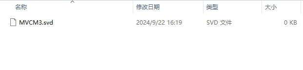

# DFP_Mode
- 下面展示的样例来自于Keil的官方文档


  
## DFP 的创建

### 1） .PDSC 文件
<details>
  
#### 1.0）介绍

- CMSIS Pack 描述文件（Pack Description File）是 CMSIS-Pack 系统中的核心文件，用于描述和定义一个设备家族包（DFP, Device Family Pack）或其他软件包的内容和结构。
- 它通过 XML 格式来表达，包含关于设备、组件、库、驱动程序、示例代码等的信息，并为开发工具（如 Keil MDK、IAR 等）提供用于集成和管理这些资源的元数据。

#### 1.1）参考文档

- [CMSIS-Pack Components Documentation](https://www.keil.com/pack/doc/CMSIS_Dev/Pack/html/cp_SWComponents.html)
- [CMSIS-Pack DFP Creation Guide](https://www.keil.com/pack/doc/CMSIS_Dev/Pack/html/createPack_DFP.html#:~:text=A%20Software%20Pack%20that%20contains%20a%20%3Cdevices%3E%20element,device%20or%20a%20device%20family%20in%20more%20detail.)

#### 1.2）命名格式

- `Vendor.Name.pdsc`
- `Vendor` 为供应商名，在 `PACK.xsd` 中有登记，开发过程中使用“Generic:5”代替。
- `Name` 为家族名，如芯片 MVCM3 包含 MVCM3100 和 MVCM3200，则 `Name` 为 MVCM3。

#### 1.3）文件格式

##### 1.3.1）结构示例
```xml
<?xml version="1.0" encoding="UTF-8"?> <!--表示该文件使用 XML 1.0 标准并采用 UTF-8 编码。-->

<package schemaVersion="1.4.0" xmlns:xs="http://www.w3.org/2001/XMLSchema-instance" xs:noNamespaceSchemaLocation="PACK.xsd">
<!--定义整个软件包；指定该 .pdsc 文件所遵循的 CMSIS Pack 描述文件的架构版本；根据URL和PACK.xsd验证XML文档结构是否符合规范-->

    <vendor></vendor>                   <!--供应商-->
    <name></name>                       <!--家族名-->

    <url></url>                         <!--定义包的下载路径（若为空则Pack Installer显示Offline）-->
    <description></description>         <!--描述-->
    <supportContact></supportContact>   <!--联系方式联系方式-->
    <license>Docs/license.txt</license> <!--许可文件-->
    <releases></releases>               <!--发行的版本日期等信息-->
    <keywords></keywords>               <!--搜索用关键词-->

    <devices></devices>                 <!--见1.32)-->
    <conditions></conditions>           <!--见1.32)-->
    <components></components>           <!--见1.32)-->

</package>
```
##### 1.3.2）关键部分示例：
<details>
  
- 在下面的部分中，将为来自设备供应商MyVendor的虚拟设备族MVCM3创建DFP。
- 设备族由四个成员组成，分为两个子族。
- mvcm3系列的规格如下:  


- 设备信息（devices）
```xml
<devices>
    <family Dfamily="MVCM3 Series" Dvendor="Generic:5">
    <processor Dcore="Cortex-M3" DcoreVersion="r2p1" Dfpu="0" Dmpu="0" Dendian="Little-endian"/>
    <description>
        The MVCM3 device family contains an ARM Cortex-M3 processor, running up to 100 MHz with a versatile set of on-chip peripherals.
    </description>
    <!-- ************************  Sub-family 'MVCM3100'  **************************** -->
    <subFamily DsubFamily="MVCM3100">
        <processor  Dclock="50000000"/>
        <!-- *************************  Device 'MVCM3110'  ***************************** -->
        <device Dname="MVCM3110">
        <memory     name="IROM1"  access="rx"       start="0x00000000"  size="0x4000"     startup="1"   default="1"/>
        <memory     name="IRAM1"  access="rw"       start="0x20000000"  size="0x0800"     init   ="0"   default="1"/>
        </device>
        <!-- *************************  Device 'MVCM3120'  ***************************** -->
        <device Dname="MVCM3120">
        <memory     name="IROM1"  access="rx"        start="0x00000000"  size="0x8000"     startup="1"   default="1"/>
        <memory     name="IRAM1"  access="rx"        start="0x20000000"  size="0x1000"     init   ="0"   default="1"/>
        </device>
    </subFamily>
    <!-- ************************  Sub Family 'MVCM3200'  **************************** -->
    <subFamily DsubFamily="MVCM3200">
        <processor  Dclock="100000000"/>
        <!-- *************************  Device 'MVCM3250'  ***************************** -->
        <device Dname="MVCM3250">
        <memory     name="IROM1"  access="rx"         start="0x00000000"  size="0x4000"     startup="1"   default="1"/>
        <memory     name="IRAM1"  access="rw"         start="0x20000000"  size="0x0800"     init   ="0"   default="1"/>
        </device>
        <!-- *************************  Device 'MVCM3260'  ***************************** -->
        <device Dname="MVCM3260">
        <memory     name="IROM1"  access="rx"         start="0x00000000"  size="0x8000"     startup="1"   default="1"/>
        <memory     name="IRAM1"  access="rw"         start="0x20000000"  size="0x1000"     init   ="0"   default="1"/>
        </device>
    </subFamily>
    </family>
</devices>
```
- 条件（conditions）
```xml
<conditions>
    <condition id="MVCM3 CMSIS-Core">
    <!-- conditions selecting Devices -->
    <description>MyVendor MVCM3 Series devices and CMSIS-Core (Cortex-M)</description>
    <require Cclass="CMSIS" Cgroup="Core"/>
    <require Dvendor="Generic:5" Dname="MVCM3*"/>
    </condition>
    
    <condition id="Startup ARM">
    <description>Startup assembler file for ARMCC</description>
    <require Tcompiler="ARMCC"/>
    </condition>

    <condition id="Startup GCC">
    <description>Startup assembler file for GCC</description>
    <require Tcompiler="GCC"/>
    </condition>

    <condition id="Startup IAR">
    <description>Startup assembler file for IAR</description>
    <require Tcompiler="IAR"/>
    </condition>
</conditions>
```                
- 组件（components）
```xml
<components>
    <component Cclass="Device" Cgroup="Startup" Cversion="0.0.1" condition="MVCM3 CMSIS-Core">
    <description>System Startup for MyVendor MVCM3 Series</description>
    <files>
        <!--  include folder -->
        <file category="include" name="Device/Include/"/>
        <file category="source"  name="Device/Source/ARM/startup_MVCM3.s" attr="config" condition="Startup ARM" version="1.0.0"/>
        <file category="source"  name="Device/Source/GCC/startup_MVCM3.s" attr="config" condition="Startup GCC" version="1.0.0"/>
        <file category="source"  name="Device/Source/IAR/startup_MVCM3.s" attr="config" condition="Startup IAR" version="1.0.0"/>
        <file category="source"  name="Device/Source/system_MVCM3.c"  attr="config" version="1.0.0"/>
    </files>
    </component>
</components>
```
</details>
</details>

### 2） DFP文件结构  
<details>  

#### 2.1）示例结构如下图：
  


#### 2.2）Device:


#### 2.3）Flash:


#### 2.4）SVD:



</details>

### 3） 生成pack
<details>

  - gen_pack.sh脚本的使用 

</details>
