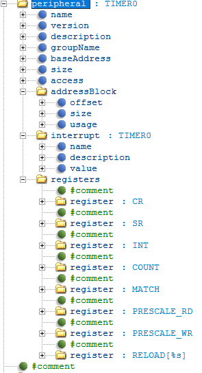

# DFP_Mode
- 本人学习过程中的总结，有问题欢迎大家指出


  
## DFP 的创建

### 1） .PDSC 文件
<details>
  
#### 1.0）介绍

- CMSIS Pack 描述文件（Pack Description File）是 CMSIS-Pack 系统中的核心文件，用于描述和定义一个设备家族包（DFP, Device Family Pack）或其他软件包的内容和结构。
- 它通过 XML 格式来表达，包含关于设备、组件、库、驱动程序、示例代码等的信息，并为开发工具（如 Keil MDK、IAR 等）提供用于集成和管理这些资源的元数据。

#### 1.1）参考文档

- [CMSIS-Pack Components Documentation](https://www.keil.com/pack/doc/CMSIS_Dev/Pack/html/cp_SWComponents.html)
- [CMSIS-Pack DFP Creation Guide](https://www.keil.com/pack/doc/CMSIS_Dev/Pack/html/createPack_DFP.html#:~:text=A%20Software%20Pack%20that%20contains%20a%20%3Cdevices%3E%20element,device%20or%20a%20device%20family%20in%20more%20detail.)

#### 1.2）命名格式

- `Vendor.Name.pdsc`
- `Vendor` 为供应商名，在 `PACK.xsd` 中有登记，开发过程中使用“Generic:5”代替。
- `Name` 为家族名，如芯片 MVCM3 包含 MVCM3100 和 MVCM3200，则 `Name` 为 MVCM3。

#### 1.3）文件格式

<details>

##### 1.3.1）结构示例

<details>

```xml
<?xml version="1.0" encoding="UTF-8"?> <!--表示该文件使用 XML 1.0 标准并采用 UTF-8 编码。-->

<package schemaVersion="1.4.0" xmlns:xs="http://www.w3.org/2001/XMLSchema-instance" xs:noNamespaceSchemaLocation="PACK.xsd">
<!--定义整个软件包；指定该 .pdsc 文件所遵循的 CMSIS Pack 描述文件的架构版本；根据URL和PACK.xsd验证XML文档结构是否符合规范-->

    <vendor></vendor>                   <!--供应商-->
    <name></name>                       <!--家族名-->

    <url></url>                         <!--定义包的下载路径（若为空则Pack Installer显示Offline）-->
    <description></description>         <!--描述-->
    <supportContact></supportContact>   <!--联系方式联系方式-->
    <license>Docs/license.txt</license> <!--许可文件-->
    <releases></releases>               <!--发行的版本日期等信息-->
    <keywords></keywords>               <!--搜索用关键词-->

    <devices></devices>                 <!--见1.32)-->
    <conditions></conditions>           <!--见1.32)-->
    <components></components>           <!--见1.32)-->

</package>
```

</details>

##### 1.3.2）关键部分示例：
<details>
  
- 在下面的部分中，将为来自设备供应商MyVendor的虚拟设备族MVCM3创建DFP。
- 设备族由四个成员组成，分为两个子族。
- mvcm3系列的规格如下:  


- 设备信息（devices）
```xml
<devices>
    <family Dfamily="MVCM3 Series" Dvendor="Generic:5">
    <processor Dcore="Cortex-M3" DcoreVersion="r2p1" Dfpu="0" Dmpu="0" Dendian="Little-endian"/>
    <description>
        The MVCM3 device family contains an ARM Cortex-M3 processor, running up to 100 MHz with a versatile set of on-chip peripherals.
    </description>
    <!-- ************************  Sub-family 'MVCM3100'  **************************** -->
    <subFamily DsubFamily="MVCM3100">
        <processor  Dclock="50000000"/>
        <!-- *************************  Device 'MVCM3110'  ***************************** -->
        <device Dname="MVCM3110">
        <memory     name="IROM1"  access="rx"       start="0x00000000"  size="0x4000"     startup="1"   default="1"/>
        <memory     name="IRAM1"  access="rw"       start="0x20000000"  size="0x0800"     init   ="0"   default="1"/>
        </device>
        <!-- *************************  Device 'MVCM3120'  ***************************** -->
        <device Dname="MVCM3120">
        <memory     name="IROM1"  access="rx"        start="0x00000000"  size="0x8000"     startup="1"   default="1"/>
        <memory     name="IRAM1"  access="rx"        start="0x20000000"  size="0x1000"     init   ="0"   default="1"/>
        </device>
    </subFamily>
    <!-- ************************  Sub Family 'MVCM3200'  **************************** -->
    <subFamily DsubFamily="MVCM3200">
        <processor  Dclock="100000000"/>
        <!-- *************************  Device 'MVCM3250'  ***************************** -->
        <device Dname="MVCM3250">
        <memory     name="IROM1"  access="rx"         start="0x00000000"  size="0x4000"     startup="1"   default="1"/>
        <memory     name="IRAM1"  access="rw"         start="0x20000000"  size="0x0800"     init   ="0"   default="1"/>
        </device>
        <!-- *************************  Device 'MVCM3260'  ***************************** -->
        <device Dname="MVCM3260">
        <memory     name="IROM1"  access="rx"         start="0x00000000"  size="0x8000"     startup="1"   default="1"/>
        <memory     name="IRAM1"  access="rw"         start="0x20000000"  size="0x1000"     init   ="0"   default="1"/>
        </device>
    </subFamily>
    </family>
</devices>
```
- 条件（conditions）
```xml
<conditions>
    <condition id="MVCM3 CMSIS-Core">
    <!-- conditions selecting Devices -->
    <description>MyVendor MVCM3 Series devices and CMSIS-Core (Cortex-M)</description>
    <require Cclass="CMSIS" Cgroup="Core"/>
    <require Dvendor="Generic:5" Dname="MVCM3*"/>
    </condition>
    
    <condition id="Startup ARM">
    <description>Startup assembler file for ARMCC</description>
    <require Tcompiler="ARMCC"/>
    </condition>

    <condition id="Startup GCC">
    <description>Startup assembler file for GCC</description>
    <require Tcompiler="GCC"/>
    </condition>

    <condition id="Startup IAR">
    <description>Startup assembler file for IAR</description>
    <require Tcompiler="IAR"/>
    </condition>
</conditions>
```                
- 组件（components）
```xml
<components>
    <component Cclass="Device" Cgroup="Startup" Cversion="0.0.1" condition="MVCM3 CMSIS-Core">
    <description>System Startup for MyVendor MVCM3 Series</description>
    <files>
        <!--  include folder -->
        <file category="include" name="Device/Include/"/>
        <file category="source"  name="Device/Source/ARM/startup_MVCM3.s" attr="config" condition="Startup ARM" version="1.0.0"/>
        <file category="source"  name="Device/Source/GCC/startup_MVCM3.s" attr="config" condition="Startup GCC" version="1.0.0"/>
        <file category="source"  name="Device/Source/IAR/startup_MVCM3.s" attr="config" condition="Startup IAR" version="1.0.0"/>
        <file category="source"  name="Device/Source/system_MVCM3.c"  attr="config" version="1.0.0"/>
    </files>
    </component>
</components>
```

</details>
</details>
</details>

### 2） DFP文件结构  
<details>  

#### 2.1）示例：
  


#### 2.2）Device:


- 介绍：放置启动文件（startup_device.s）、系统文件（system_device.c system_device.h）、寄存器文件（device.h）以及驱动函数等文件。
- 示例：
  
  
  
  
  

<details>

##### 2.2.1）startup_device.s：

- 设备上电或复位后执行的第一段代码。它负责在硬件复位后初始化堆栈、设置中断向量表、初始化全局和静态变量，并最终跳转到主程序的 main() 函数。

##### 2.2.2）system_device.c：

- 设备初始化的核心文件，负责对系统时钟、外设时钟、内存布局等进行配置。包含了 SystemInit() 函数，该函数在设备启动时被 startup_device.s 调用，进行硬件初始化。

##### 2.2.3）system_device.h：

- 为 system_device.c 中的系统初始化函数提供声明，同时包含一些与系统初始化相关的常量、宏和外部变量声明（如 SystemCoreClock）。

##### 2.2.4）device.h：

- 定义设备的外设寄存器映射、位域、内存地址等内容，使开发者可以通过结构体和宏访问设备外设。
- 可以通过CMSIS提供的SVDConv工具依据你的SVD文件直接生成
- SVDConv的使用：
  - 调用示例：SVDConv MVCM3.svd --generate=header --fields=struct
  - SVDConv: 表示调用 SVDConv 工具。这个工具通常是在安装 CMSIS 之后可用。确保在命令行中可以访问它（即它的路径已被添加到环境变量中）。
  - MVCM3.svd: 这是输入的 SVD 文件，包含了设备寄存器的描述信息。此文件需要位于当前工作目录中或者使用完整的文件路径。
  - --generate=header: 指定生成 C 头文件。默认情况下，它会将 SVD 文件中的寄存器描述转换为 C 结构体表示的头文件。
  - --fields=struct: 这个选项表示在生成头文件时，将寄存器字段表示为结构体。这意味着每个寄存器字段都会被分解为更小的结构体单元。

##### 2.2.5）Peripherals_Driver：
- 该文件夹下存放芯片的外设驱动，并在PDSC文件中声明，如下：

```xml
    <component Cclass="Device" Cgroup="Peripheral Driver" Csub="I2C" Cversion="0.0.1" >
      <description>example</description>
      <files>
        <file category="header" name="Device/Peripheral_Drivers/Include/MVCM3_i2c.h"/>
        <file category="source" name="Device/Peripheral_Drivers/Source/MVCM3_i2c.c"/>
      </files>
    </component>
```
  
</details>

#### 2.3）Flash:

- 参考文档：
  - [Pack with Device Support](https://www.keil.com/pack/doc/CMSIS_Dev/Pack/html/createPack_DFP.html#:~:text=A%20Software%20Pack%20that%20contains%20a%20%3Cdevices%3E%20element,device%20or%20a%20device%20family%20in%20more%20detail.)
  - [Flash Programming](https://www.keil.com/pack/doc/CMSIS_Dev/Pack/html/flashAlgorithm.html)
  - [利用MDK的FLM文件制作通用flash驱动](https://cloud.tencent.com/developer/article/2230443)
  - [从零编写STM32H7的MDK SPI FLASH下载算法](https://mp.weixin.qq.com/s/IpEG3jN-Nx4Dm1ETxNBkgg)
- 示例：


<details>

##### 2.3.1）操作流程：  

<details>

- 1）将以下文件复制到你的 Vendor.Name/Flash下
  - 一般位于Keil_v5\ARM\Flash\_Template路径下（v540版本）
  - 其中的FlashOS.h位于上级目录（v540版本）
 
- 2）修改其中的三个工程文件，将“NewDevice”替换为你的设备名
- 3）修改其中的FlashDev.c和FlashPrg.c文件
- 4）通过Keil生成FLM文件

</details>

##### 2.3.2）修改FlashDev.c：  

<details>

- 1）介绍：
  - 定义一个FlashDevice结构体用于描述 Flash 设备的详细特性描述，包括设备的大小、扇区布局、页大小等信息。
  - 为工具提供必要的元数据，以便在进行 Flash 操作（如擦除、编程、读取）时，能够正确处理设备的存储布局。
- 2）示例：
  ```c
    struct FlashDevice const FlashDevice  =  {
       FLASH_DRV_VERS,             // 驱动版本
       "Example Flash",            // 设备名称
       ONCHIP,                     // 设备类型（片上 Flash）
       0x08000000,                 // 起始地址
       0x00100000,                 // 总大小 (1MB)
       256,                        // 页大小
       0,                          // 保留
       0xFF,                       // 擦除后的默认值
       5000,                       // 编程超时（毫秒）
       10000,                      // 擦除超时（毫秒）
       
       // 扇区布局
       0x08000000, 0x1000,    // 每个扇区 4KB
       0x08010000, 0x20000,   // 每个扇区 128KB
       SECTOR_END 
    };
  ```

</details>  

##### 2.3.3）修改FlashPrg.c：  

<details>

- 1）介绍：
  - Keil 环境下的 Flash 编程算法的实现文件，它通过与 Flash 控制器的直接交互来完成擦除、写入、校验等操作。
- 2）示例：
  ```c
  int Init (unsigned long adr, unsigned long clk, unsigned long fnc) {
      // 初始化 Flash 编程设置，如地址和时钟频率
      // 配置寄存器，准备擦除或编程操作
      return 0;
  }
  
  int UnInit (unsigned long fnc) {
      // 反初始化，释放 Flash 资源
      return 0;
  }

  int EraseSector (unsigned long adr) {
      // 擦除指定地址的扇区
      return 0;
  }
  
  int EraseChip (void) {
      //擦除整个 Flash 存储器
      return 0;
  }
  
  int ProgramPage (unsigned long adr, unsigned long sz, unsigned char *buf) {
      // 将数据写入指定的 Flash 页面
      return 0;
  }
  ```
  
</details>
  
##### 2.3.4）生成FLM：  

<details>

- 1）打开Flash文件夹的工程
  
- 2）将输出文件命名为设备名
  
- 3）编译
- 4）在PDSC文件中添加FLM文件的路径,如下：
```xml
<device Dname="MVCM3110">
  <algorithm name="Flash/MVCM3.FLM" start="0x00000000" size="0x4000" default="1"/>
  <memory     name="IROM1"  access="rx"       start="0x00000000"  size="0x4000"     startup="1"   default="1"/>
  <memory     name="IRAM1"  access="rw"       start="0x20000000"  size="0x0800"     init   ="0"   default="1"/>
</device>
``` 
- 5）重新生成pack并导入，在对应的工程中可以看到
  

</details>
</details>

#### 2.4）SVD:


<details>

##### 2.4.1）介绍:

<details>

- 定义：SVD（System View Description） 文件是 CMSIS（Common Microcontroller Software Interface Standard） 中的定义的一个 XML 格式的纯文本文件，其包含了芯片内核、芯片所具有的外设以及内核和外设的寄存器的完整描述
- 作用：
  - 生成头文件（device.h）：使用相关工具命令（SVDConv.exe device.svd -o Output -b Output/device.log --generate=header）就可以根据编写的 SVD 文件直接生成芯片的顶级头文件（device.svd --> device.h）
  - 调试 ：SVD 文件最主要的目的是调试时直接显示寄存器的每个比特位的状态。
- 参考文档：
  - [TIH64 之一 编写 TIH64Vx690 的 SVD 文件及使用 SVD 辅助调试_svd 和 sfr文件的区别](https://blog.csdn.net/zcshoucsdn/article/details/127144450)
  - [System View Description](https://www.keil.com/pack/doc/CMSIS_Dev/SVD/html/index.html)

</details>

##### 2.4.2）文件格式:

<details>
  
- 参考文档：
  - [SVD Description (*.svd) Format](https://www.keil.com/pack/doc/CMSIS_Dev/SVD/html/svd_Format_pg.html)
  - [/device element](https://www.keil.com/pack/doc/CMSIS_Dev/SVD/html/elem_device.html)
  - [/device/cpu element](https://www.keil.com/pack/doc/CMSIS_Dev/SVD/html/elem_cpu.html)
  - [/device/peripherals element](https://www.keil.com/pack/doc/CMSIS_Dev/SVD/html/elem_peripherals.html)
  - [/device/peripherals/peripheral/registers element](https://www.keil.com/pack/doc/CMSIS_Dev/SVD/html/elem_registers.html)
  - [Special Elements](https://www.keil.com/pack/doc/CMSIS_Dev/SVD/html/elem_special.html)
- 示例：
  - [SVD File Example](https://www.keil.com/pack/doc/CMSIS_Dev/SVD/html/svd_Example_pg.html)
  - 设备元素结构：
  - 
  - 外设元素结构
  - 
  
</details>

##### 2.4.3）各元素解析:

<details>

- 内容过多，可以参考官方文档
  -  [/device/cpu element](https://www.keil.com/pack/doc/CMSIS_Dev/SVD/html/elem_cpu.html)
  - 以下是部分内容截图：
    
    
    

</details>
</details>
</details>

### 3） 生成PACK
<details>

- 脚本介绍：
  - 检查PDSC文件的可用性、复制PDSC文件到文件目录、在文件目录运行PackChk.exe、在工作目录创建一个包文件。它会被称为 Vendor.Name.Version.pack
- 具体步骤：
  - 1）进入DFP文件夹下
  - 2）完善DPSC文件的内容
  - 3）修改gen_pack.sh内的部分内容（具体脚本中有解释）
  - 4）运行脚本（使用git bash打开DFP文件夹并在运行脚本）

</details>
